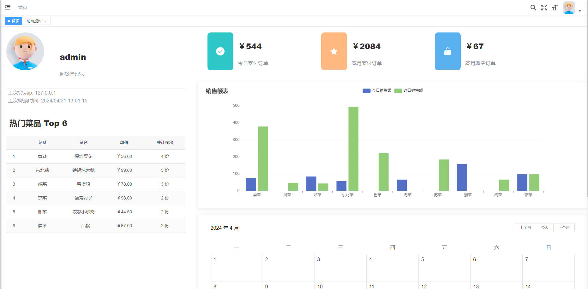
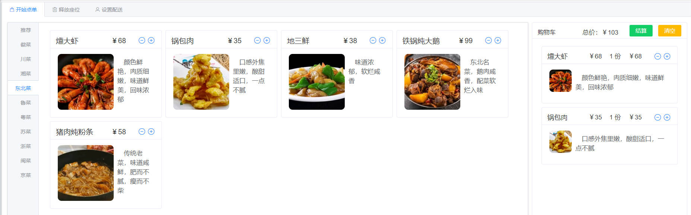
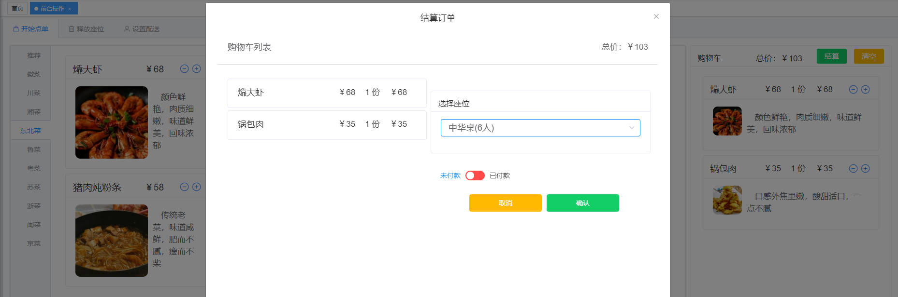
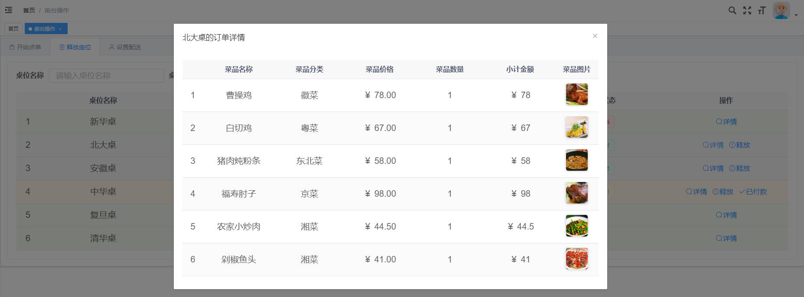
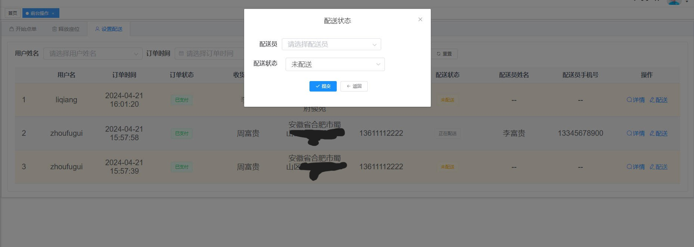
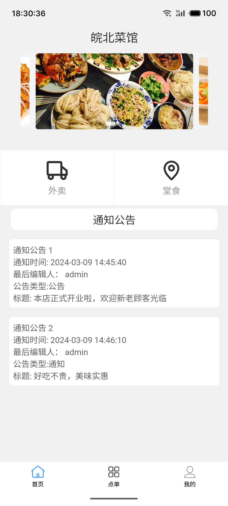
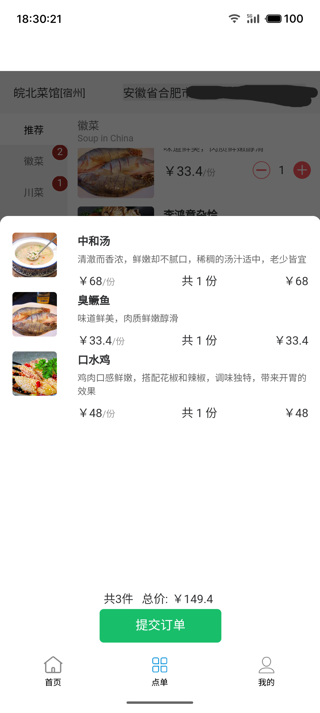
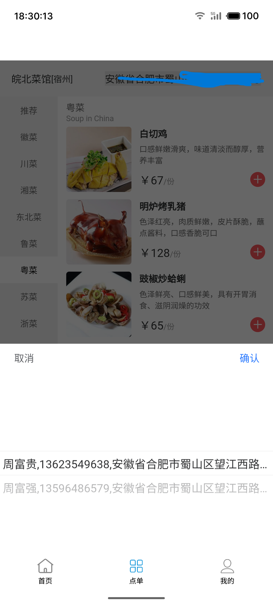
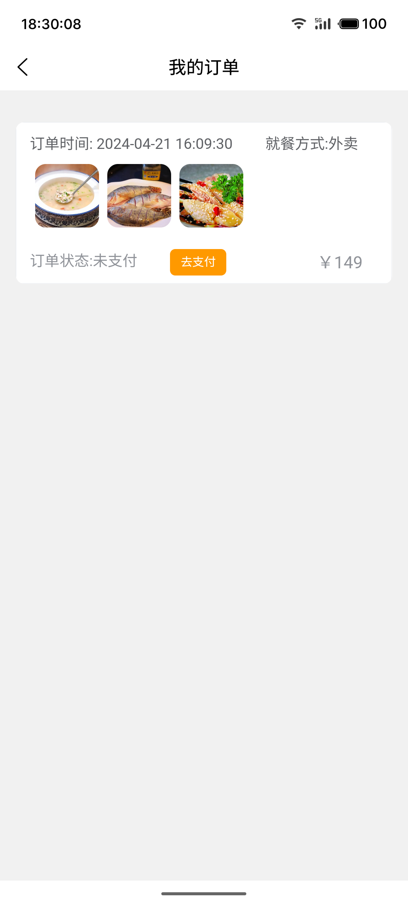

​	本科毕业论文项目，分为管理端与用户端,web端作管理端,拥有权限的账户登录后可以进行餐馆的基本信息管理及导入导出等,例如菜品分 类、菜品、桌位、订单、配送员、公告等,首页展示了热卖菜品排行、当日销售额、当月销售额、各菜品分类两日内销售额折线图等,还做了一个用于前台操作的前台页面,包含点单、释放座位、设置配送的功能;用户端使用uniapp制作,包含点单、购物车、收货地址、订单等功能点单前可选堂食或配送。

特别鸣谢：
[RuoYi-Vue](https://gitee.com/y_project/RuoYi-Vue)
[RuoYi-App](https://gitee.com/y_project/RuoYi-App)

